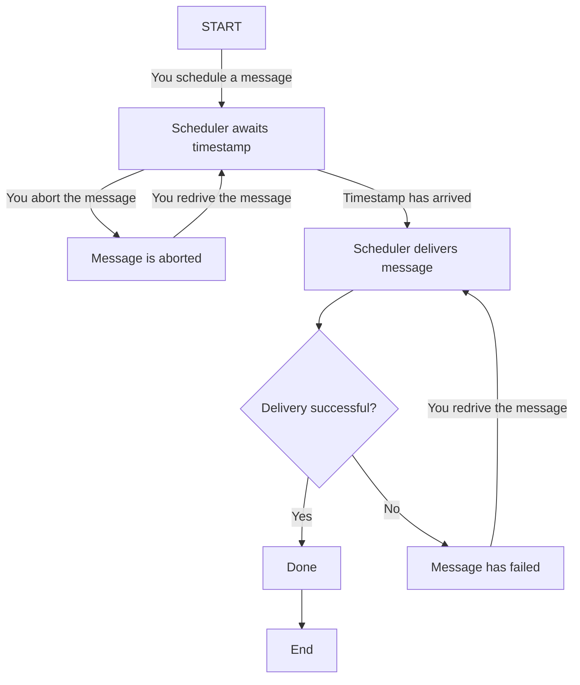

# Message Lifecycle

Document state: DRAFT

This document describes the lifecycle of a message, from scheduling to delivery.

After you schedule a message, the scheduler waits for the timestamp when the message shall be delivered. Until that timestamp you can abort the message. It will not be sent to your endpoint, but you are still charged for scheduling the message.

Once the timestamp arrives, the scheduler tries to deliver the message. If the delivery fails, the scheduler marks the message as failed. You can then redrive the message so that the scheduler makes another attempt asap.

